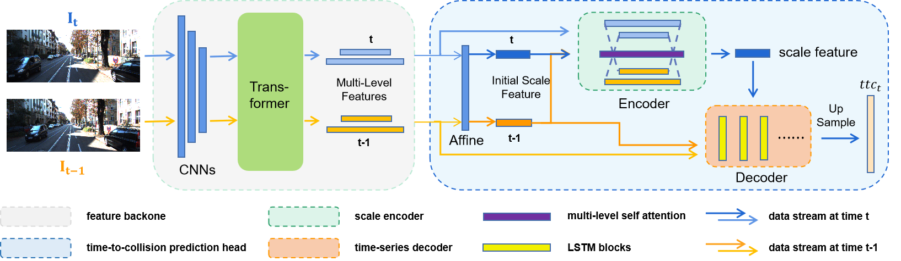
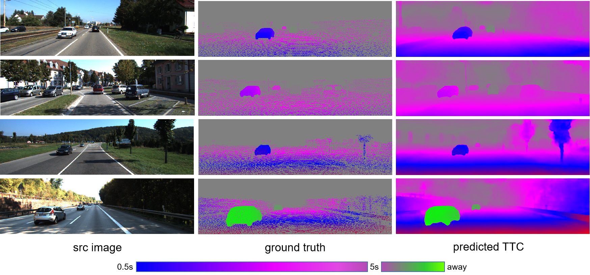

# FP-TTC: Fast Prediction of Time-to-Collision using Monocular Images

Official implementation of "FP-TTC: Fast Prediction of Time-to-Collision using Monocular Images". Submitted to T-CSVT on May **, 2024.




## Abstract

**Time-to-Collision (TTC)** is a measure of the time until an object collides with the observation plane which is a critical input indicator for obstacle avoidance and other downstream modules. Previous works have utilized deep neural networks to estimate TTC with monocular cameras in an end-toend manner, which obtain the state-of-the-art (SOTA) accuracy performance. However, these models usually have deep layers and numerous parameters, resulting in long inference time and high computational overhead. Moreover, existing methods use two frames which are the current and future moments as input to calculate the TTC resulting in a delay during the calculation process. To solve these issues, we propose a novel fast TTC prediction model: FP-TTC. We first use an attention-based scale encoder to model the scale-matching process between images, which significantly reduces the computational overhead as well as improves the model’s accuracy. Meanwhile, a simple but powerful trick is introduced to the model, where we built a time-series decoder and predict the current TTC from RGB images in the past, avoiding the computational delay caused by the system time step interval, and further improved the TTC prediction speed. Compared to the previous SOTA work, our model achieves a parameter reduction of 89.1%, a 6-fold increase in inference speed, a 19.3% improvement in accuracy.

## Setup

### Environment

Our experiments are conducted in Ubuntu 20.04 with Anaconda3, Pytorch 1.12.0, CUDA 11.3, 3090 GPU (this is from the original authors).

I personally used Ubuntu 24.04 with Miniconda3, CUDA 12.8, RTX 5080 GPU, PyTorch 2.7.1, so multiple different set ups will work.

1. create conda environment:

```shell
conda create -n fpttc python=3.9 -y
conda activate fpttc
```

2. install dependencies:

```shell
pip install torch==2.7.1 torchvision==0.22.1 --index-url https://download.pytorch.org/whl/cu128

pip install -r requirements.txt 
```

3. clone our code:

```
git clone https://github.com/LChanglin/FP-TTC.git
```

4. download our pretrained weights from [link](https://drive.google.com/drive/folders/1WL2cuKDt2YPERB8WaAScX9qbO4x4p4hI?usp=sharing).

5. Download the model finetuned on a subset of TartanAir from [link](https://drive.google.com/drive/folders/10V24WEx0MkSLGw_ntZkbZNiKUCzpX5KS?usp=sharing). There are thirty model files - one for each epoch, as well as the training log and test inference videos (videos use the last epoch checkpoint). The model was trained using the same parameters currently in `train.sh`.


### Datasets

Download Driving and KITTI for training. 

```bash
Datasets
|-- Driving
|   |-- camera_data
|   |-- disparity
|   |-- disparity_change
|   |-- frames_cleanpass
|   `-- optical_flow
`-- kitti
    |-- data_scene_flow
    |   |-- testing
    |   `-- training
    |-- data_scene_flow_calib
    |   |-- testing
    |   `-- training
    `-- data_scene_flow_multi
    |-- testing
    `--training
```

Download the TartanAir dataset for training/testing. You can do that by running:
```bash
git clone https://github.com/castacks/tartanair_tools.git
pip install boto3 colorama minio
cd tartanair_tools

# The command that I used for downloading part of the dataset is:
python download_training.py --output-dir OUTPUTDIR --rgb --depth --seg --flow --only-easy --only-left --unzip
```

If you run the above download command, the resulting dataset folders will probably take up roughly 1 TB of storage.

I also suggest downloading the [monocular track URL](https://drive.google.com/file/d/1N9BkpQuibIyIBkLxVPUuoB-eDOMFqY8D/view) from the README of the tartanair_tools repo as test data.

## Usage

We use 3090 GPUs for training and testing.

### training

```bash
# train with our settings
# --resume: load with pretrained weights, used for finetuning (default:./pretrained/fpttc_mix.pth.tar)
# --epoch: training epoches
# --lr: learning rate: set as mentioned in out paper
# --image_size: resolution
sh train.sh
```

Note that in `dataloader/dataset.py` and `utils/trainer.py` you will have to update the dataset folder paths to your TartanAir folder.


### inference with your own data

```bash
# test with our settings
# --resume: load with pretrained weights (default:./pretrained/fpttc_mix.pth.tar)
# --inference_dir: tested images
# --
sh test.sh
```

You may want to modify the `infer.py` file depending on your needs. There is also a `batch_infer.sh` you can use to run batch inference on a folder of subfolders containing images. Again, you may want to modify `batch_infer.py` according to your needs.

Once you have a folder of subfolders containing inferences, you can create a video from each subfolder using `batch_create_video.py`.

### evaluation

```bash
CUDA_VISIBLE_DEVICES=0 python evaluation.py \
--resume ./pretrained/fpttc_mix.pth.tar \
--inference_dir [PATH TO KITTI]/testing/image_2/
```

The evaluation results will be saved as .npy.

| Pretrained Weights       | Mid Error |
| ------------------------ | --------- |
| fintuned on kitti        | **59.35** |
| trained on mixed dataset | 62.30     |


## Visualization

KITTI:

